# To create a custom VPC1
~ $ aws ec2 create-vpc --cidr-block 10.0.0.0/16
{
    "Vpc": {
        "OwnerId": "856221042950",
        "InstanceTenancy": "default",
        "Ipv6CidrBlockAssociationSet": [],
        "CidrBlockAssociationSet": [
            {
                "AssociationId": "vpc-cidr-assoc-00d105b092b668203",
                "CidrBlock": "10.0.0.0/16",
                "CidrBlockState": {
                    "State": "associated"
                }
            }
        ],
        "IsDefault": false,
        "VpcId": "vpc-02fd2ebf8956df75e",
        "State": "pending",
        "CidrBlock": "10.0.0.0/16",
        "DhcpOptionsId": "dopt-01232e6c53d094fca"
    }
}

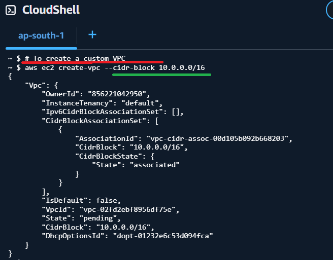

 # to create a subnet
~ $ aws ec2 create-subnet \
>   --vpc-id vpc-02fd2ebf8956df75e \
>   --cidr-block 10.0.1.0/24
{
    "Subnet": {
        "AvailabilityZoneId": "aps1-az1",
        "MapCustomerOwnedIpOnLaunch": false,
        "OwnerId": "856221042950",
        "AssignIpv6AddressOnCreation": false,
        "Ipv6CidrBlockAssociationSet": [],
        "SubnetArn": "arn:aws:ec2:ap-south-1:856221042950:subnet/subnet-09b86bf5c559255d6",
        "EnableDns64": false,
        "Ipv6Native": false,
        "PrivateDnsNameOptionsOnLaunch": {
            "HostnameType": "ip-name",
            "EnableResourceNameDnsARecord": false,
            "EnableResourceNameDnsAAAARecord": false
        },
        "SubnetId": "subnet-09b86bf5c559255d6",
        "State": "available",
        "VpcId": "vpc-02fd2ebf8956df75e",
        "CidrBlock": "10.0.1.0/24",
        "AvailableIpAddressCount": 251,
        "AvailabilityZone": "ap-south-1a",
        "DefaultForAz": false,
        "MapPublicIpOnLaunch": false
    }
}
~ $ # aws ec2 create internet gateway
~ $ # to creat IGW
~ $ aws ec2 create-internet-gateway --tag-specifications resourceType Internet-gateway Tags key=Name, Value=ing1

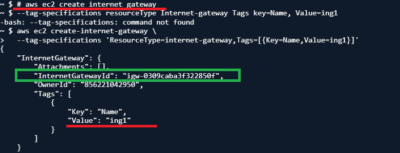

~ $ # aws ec2 create internet gateway
~ $ --tag-specifications resourceType Internet-gateway Tags key=Name, Value=ing1
-bash: --tag-specifications: command not found
~ $ aws ec2 create-internet-gateway \
>   --tag-specifications 'ResourceType=internet-gateway,Tags=[{Key=Name,Value=ing1}]'
{
    "InternetGateway": {
        "Attachments": [],
        "InternetGatewayId": "igw-0309caba3f322850f",
        "OwnerId": "856221042950",
        "Tags": [
            {
                "Key": "Name",
                "Value": "ing1"
            }
        ]
    }
}
~ $ # To attach igw with my vpc 
~ $ aws ec2 attach-internet-gateway \
>   --internet-gateway-id igw-0309caba3f322850f \
>   --vpc-id vpc-02fd2ebf8956df75e

# to verify
~ $ aws ec2 describe-internet-gateways \
>   --internet-gateway-ids igw-0309caba3f322850f
{
    "InternetGateways": [
        {
            "Attachments": [
                {
                    "State": "available",
                    "VpcId": "vpc-02fd2ebf8956df75e"
                }
            ],
            "InternetGatewayId": "igw-0309caba3f322850f",
            "OwnerId": "856221042950",
            "Tags": [
                {
                    "Key": "Name",
                    "Value": "ing1"
                }
            ]
        }
    ]
}

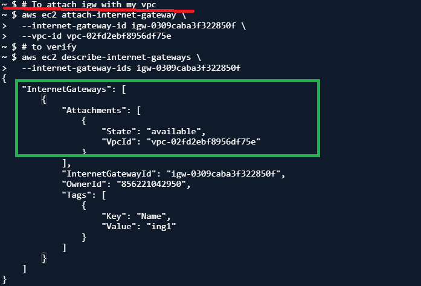

 # To create route table
~ $ aws ec2 create-route-table \
>   --vpc-id vpc-02fd2ebf8956df75e \
>   --tag-specifications 'ResourceType=route-table,Tags=[{Key=Name,Value=CustomRouteTable}]'
{
    "RouteTable": {
        "Associations": [],
        "PropagatingVgws": [],
        "RouteTableId": "rtb-0013ed38b6b67f81d",
        "Routes": [
            {
                "DestinationCidrBlock": "10.0.0.0/16",
                "GatewayId": "local",
                "Origin": "CreateRouteTable",
                "State": "active"
            }
        ],
        "Tags": [
            {
                "Key": "Name",
                "Value": "CustomRouteTable"
            }
        ],
        "VpcId": "vpc-02fd2ebf8956df75e",
        "OwnerId": "856221042950"
    },
    "ClientToken": "bf9ebf9f-27b7-4fab-8c5e-aa6f2985a589"
}

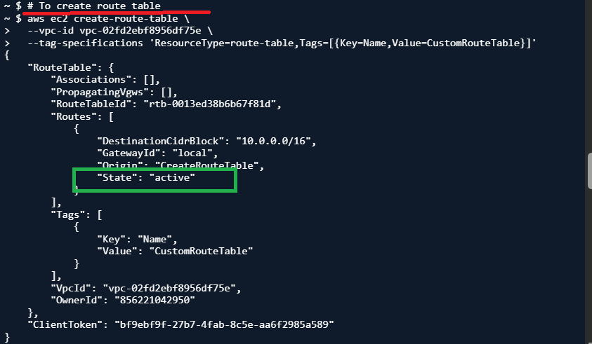

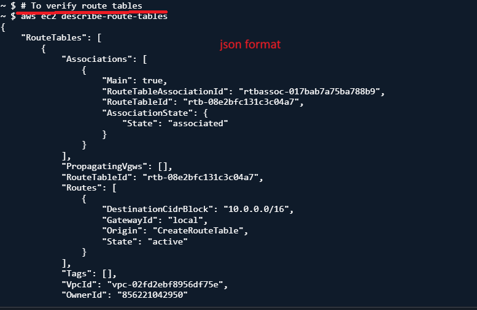

# To verify route tables
~ $ aws ec2 describe-route-tables
{
    "RouteTables": [
        {
            "Associations": [
                {
                    "Main": true,
                    "RouteTableAssociationId": "rtbassoc-017bab7a75ba788b9",
                    "RouteTableId": "rtb-08e2bfc131c3c04a7",
                    "AssociationState": {
                        "State": "associated"
                    }
                }
            ],
            "PropagatingVgws": [],
            "RouteTableId": "rtb-08e2bfc131c3c04a7",
            "Routes": [
                {
                    "DestinationCidrBlock": "10.0.0.0/16",
                    "GatewayId": "local",
                    "Origin": "CreateRouteTable",
                    "State": "active"
                }
            ],
            "Tags": [],
            "VpcId": "vpc-02fd2ebf8956df75e",
        
        
            "OwnerId": "856221042950"
        },
    ]
        {
    
        }
}

# verify route table

 aws ec2 describe-route-tables --output table
-------------------------------------------------------------------------------------
|                                DescribeRouteTables                                |
+-----------------------------------------------------------------------------------+
||                                   RouteTables                                   ||
|+------------------+------------------------------+-------------------------------+|
||      OwnerId     |        RouteTableId          |             VpcId             ||
|+------------------+------------------------------+-------------------------------+|
||  856221042950    |  rtb-08e2bfc131c3c04a7       |  vpc-02fd2ebf8956df75e        ||
|+------------------+------------------------------+-------------------------------+|
|||                                 Associations                                  |||
||+--------+--------------------------------------+-------------------------------+||
|||  Main  |       RouteTableAssociationId        |         RouteTableId          |||
||+--------+--------------------------------------+-------------------------------+||
|||  True  |  rtbassoc-017bab7a75ba788b9          |  rtb-08e2bfc131c3c04a7        |||
||+--------+--------------------------------------+-------------------------------+||
||||                              AssociationState                               ||||
|||+-----------------------------+-----------------------------------------------+|||
||||  State                      |  associated                                   ||||
|||+-----------------------------+-----------------------------------------------+|||
|||                                    Routes                                     |||
||+---------------------------+---------------+-----------------------+-----------+||
|||   DestinationCidrBlock    |   GatewayId   |        Origin         |   State   |||
||+---------------------------+---------------+-----------------------+-----------+||
|||  10.0.0.0/16              |  local        |  CreateRouteTable     |  active   |||
||+---------------------------+---------------+-----------------------+-----------+||
||                                   RouteTables                                   ||
|+------------------+------------------------------+-------------------------------+|
||      OwnerId     |        RouteTableId          |             VpcId             ||

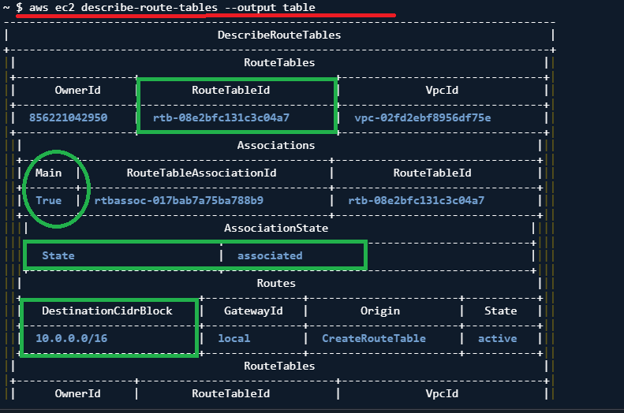

 # To add route in route table
~ $ aws ec2 create-route \
>   --route-table-id rtb-0013ed38b6b67f81d \
>   --destination-cidr-block 0.0.0.0/0 \
>   --gateway-id igw-0309caba3f322850f
{
    "Return": true
}

 # verify route

~ $ aws ec2 describe-route-tables \
>   --route-table-ids rtb-0013ed38b6b67f81d \
>   --output table
-------------------------------------------------------------------------------------
|                                DescribeRouteTables                                |
+-----------------------------------------------------------------------------------+
||                                   RouteTables                                   ||
|+------------------+------------------------------+-------------------------------+|
||      OwnerId     |        RouteTableId          |             VpcId             ||
|+------------------+------------------------------+-------------------------------+|
||  856221042950    |  rtb-0013ed38b6b67f81d       |  vpc-02fd2ebf8956df75e        ||
|+------------------+------------------------------+-------------------------------+|
|||                                    Routes                                     |||
||+----------------------+-------------------------+--------------------+---------+||
||| DestinationCidrBlock |        GatewayId        |      Origin        |  State  |||
||+----------------------+-------------------------+--------------------+---------+||
|||  10.0.0.0/16         |  local                  |  CreateRouteTable  |  active |||
|||  0.0.0.0/0           |  igw-0309caba3f322850f  |  CreateRoute       |  active |||
||+----------------------+-------------------------+--------------------+---------+||
|||                                     Tags                                      |||
||+---------------------+---------------------------------------------------------+||
|||         Key         |                          Value                          |||
||+---------------------+---------------------------------------------------------+||
|||  Name               |  CustomRouteTable                                       |||
||+---------------------+---------------------------------------------------------+||
~ $ 

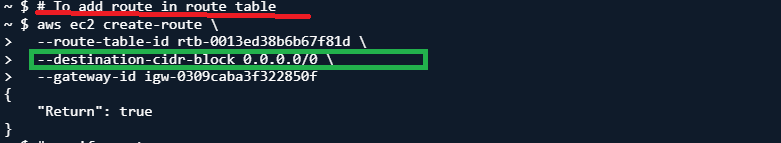

#  To subnet association
~ $ aws ec2 associate-route-table \
>   --subnet-id subnet-09b86bf5c559255d6 \
>   --route-table-id rtb-0013ed38b6b67f81d
{
    "AssociationId": "rtbassoc-026e614537af665c7",
    "AssociationState": {
        "State": "associated"
    }
}

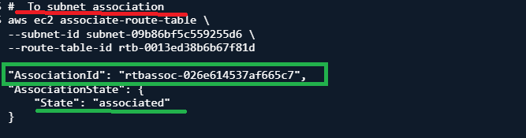

 # verify association
~ $ aws ec2 describe-route-tables \
>   --route-table-ids rtb-0013ed38b6b67f81d \
>   --query "RouteTables[*].Associations[*].{Subnet:SubnetId,RouteTable:RouteTableId,Main:Main}" \
>   --output table
----------------------------------------------------------------
|                      DescribeRouteTables                     |
+-------+-------------------------+----------------------------+
| Main  |       RouteTable        |          Subnet            |
+-------+-------------------------+----------------------------+
|  False|  rtb-0013ed38b6b67f81d  |  subnet-09b86bf5c559255d6  |
+-------+-------------------------+----------------------------+
~ $ 

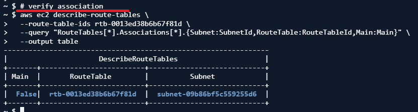

TASK BY SIR

# To create vpc2 in same region with tag specification
~ $ aws ec2 create-vpc \
>   --cidr-block 10.1.0.0/16 \
>   --tag-specifications 'ResourceType=vpc,Tags=[{Key=Name,Value=VPC2}]'
{
    "Vpc": {
        "OwnerId": "856221042950",
        "InstanceTenancy": "default",
        "Ipv6CidrBlockAssociationSet": [],
        "CidrBlockAssociationSet": [
            {
                "AssociationId": "vpc-cidr-assoc-0d94767004d96328c",
                "CidrBlock": "10.1.0.0/16",
                "CidrBlockState": {
                    "State": "associated"
                }
            }
        ],
        "IsDefault": false,
        "Tags": [
            {
                "Key": "Name",
                "Value": "VPC2"
            }
        ],
        "VpcId": "vpc-0529a37af1b8775b8",
        "State": "pending",
        "CidrBlock": "10.1.0.0/16",
        "DhcpOptionsId": "dopt-01232e6c53d094fca"
    }
}

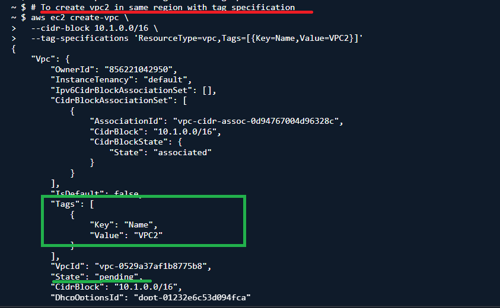

 # create a subnet for it (subnet2)
~ $ aws ec2 create-subnet \
>   --vpc-id vpc-0529a37af1b8775b8 \
>   --cidr-block 10.1.1.0/24 \
>   --availability-zone ap-south-1a \
>   --tag-specifications 'ResourceType=subnet,Tags=[{Key=Name,Value=Subnet2}]'
{
    "Subnet": {
        "AvailabilityZoneId": "aps1-az1",
        "MapCustomerOwnedIpOnLaunch": false,
        "OwnerId": "856221042950",
        "AssignIpv6AddressOnCreation": false,
        "Ipv6CidrBlockAssociationSet": [],
        "Tags": [
            {
                "Key": "Name",
                "Value": "Subnet2"
            }
        ],
        "SubnetArn": "arn:aws:ec2:ap-south-1:856221042950:subnet/subnet-013d0b4e7c5183115",
        "EnableDns64": false,
        "Ipv6Native": false,
        "PrivateDnsNameOptionsOnLaunch": {
            "HostnameType": "ip-name",
            "EnableResourceNameDnsARecord": false,
            "EnableResourceNameDnsAAAARecord": false
        },
        "SubnetId": "subnet-013d0b4e7c5183115",
        "State": "available",
        "VpcId": "vpc-0529a37af1b8775b8",
        "CidrBlock": "10.1.1.0/24",
        "AvailableIpAddressCount": 251,
        "AvailabilityZone": "ap-south-1a",
        "DefaultForAz": false,
    }
},

# Steps to make VPC2 public
 ## Create an Internet Gateway (IGW) for VPC2
~ $ aws ec2 create-internet-gateway \
>   --tag-specifications 'ResourceType=internet-gateway,Tags=[{Key=Name,Value=IGW2}]'
{
    "InternetGateway": {
        "Attachments": [],
        "InternetGatewayId": "igw-010e5b882cbfd46b8",
        "OwnerId": "856221042950",
        "Tags": [
            {
                "Key": "Name",
                "Value": "IGW2"
            }
        ]
    }
}
~ $ 

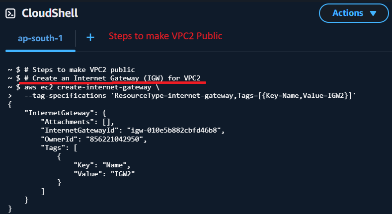

# Attach the IGW to VPC2
~ $ aws ec2 attach-internet-gateway \
>   --internet-gateway-id igw-010e5b882cbfd46b8 \
>   --vpc-id vpc-0529a37af1b8775b8

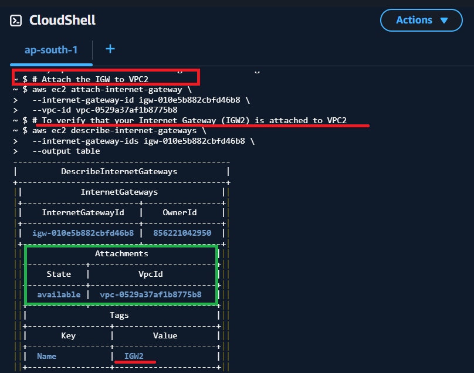

# To verify that your Internet Gateway (IGW2) is attached to VPC2

~ $ aws ec2 describe-internet-gateways \
>   --internet-gateway-ids igw-010e5b882cbfd46b8 \
>   --output table
---------------------------------------------
|         DescribeInternetGateways          |
+-------------------------------------------+
||            InternetGateways             ||
|+------------------------+----------------+|
||    InternetGatewayId   |    OwnerId     ||
|+------------------------+----------------+|
||  igw-010e5b882cbfd46b8 |  856221042950  ||
|+------------------------+----------------+|
|||              Attachments              |||
||+------------+--------------------------+||
|||    State   |          VpcId           |||
||+------------+--------------------------+||
|||  available |  vpc-0529a37af1b8775b8   |||
||+------------+--------------------------+||
|||                 Tags                  |||
||+-----------------+---------------------+||
|||       Key       |        Value        |||
||+-----------------+---------------------+||
|||  Name           |  IGW2               |||
||+-----------------+---------------------+||
~ $ 
+-----------------+---------------------+||

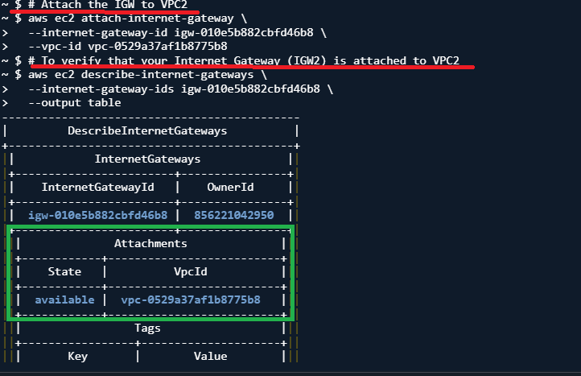

# Create a route table for VPC2

~ $ aws ec2 create-route-table \
>   --vpc-id vpc-0529a37af1b8775b8 \
>   --tag-specifications 'ResourceType=route-table,Tags=[{Key=Name,Value=VPC2-RouteTable}]'
{
    "RouteTable": {
        "Associations": [],
        "PropagatingVgws": [],
        "RouteTableId": "rtb-05f2336e768fc0e73",
        "Routes": [
            {
                "DestinationCidrBlock": "10.1.0.0/16",
                "GatewayId": "local",
                "Origin": "CreateRouteTable",
                "State": "active"
            }
        ],
        "Tags": [
            {
                "Key": "Name",
                "Value": "VPC2-RouteTable"
            }
        ],
        "VpcId": "vpc-0529a37af1b8775b8",
        "OwnerId": "856221042950"
    },
    "ClientToken": "4a972c69-b72e-4b42-9a5c-f7eb7f06d661"
}

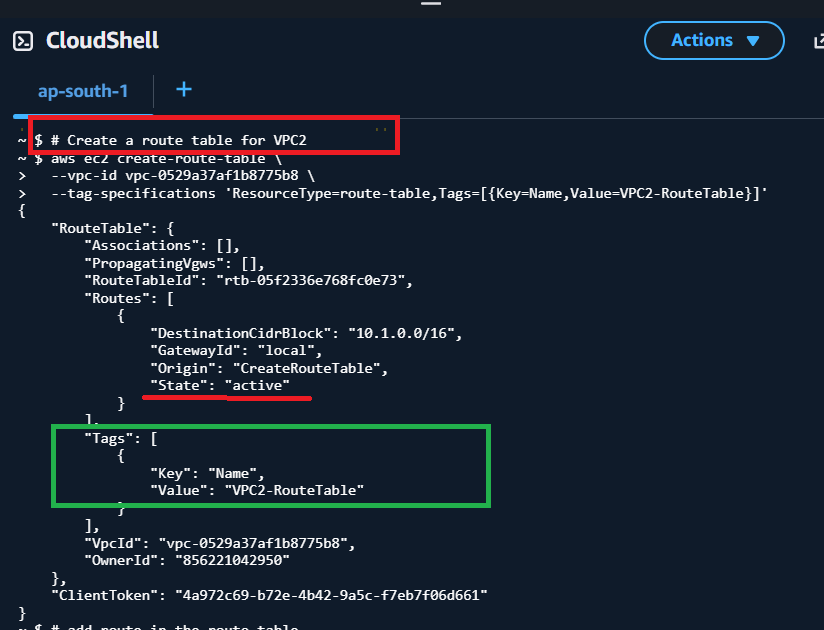

# add route in the route table

~ $ aws ec2 create-route \
>   --route-table-id rtb-05f2336e768fc0e73 \
>   --destination-cidr-block 0.0.0.0/0 \
>   --gateway-id igw-010e5b882cbfd46b8
{
    "Return": true
}

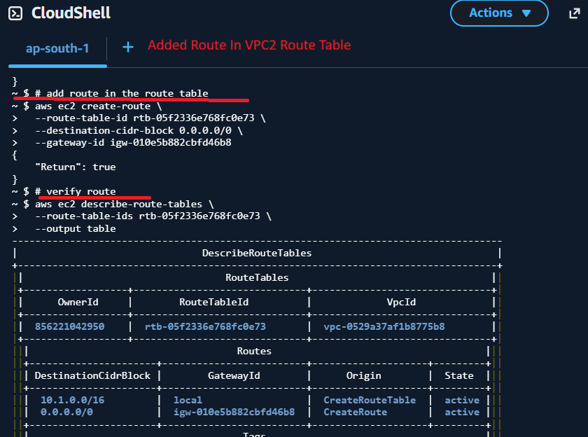

# verify route

~ $ aws ec2 describe-route-tables \
>   --route-table-ids rtb-05f2336e768fc0e73 \
>   --output table
-------------------------------------------------------------------------------------
|                                DescribeRouteTables                                |
+-----------------------------------------------------------------------------------+
||                                   RouteTables                                   ||
|+------------------+------------------------------+-------------------------------+|
||      OwnerId     |        RouteTableId          |             VpcId             ||
|+------------------+------------------------------+-------------------------------+|
||  856221042950    |  rtb-05f2336e768fc0e73       |  vpc-0529a37af1b8775b8        ||
|+------------------+------------------------------+-------------------------------+|
|||                                    Routes                                     |||
||+----------------------+-------------------------+--------------------+---------+||
||| DestinationCidrBlock |        GatewayId        |      Origin        |  State  |||
||+----------------------+-------------------------+--------------------+---------+||
|||  10.1.0.0/16         |  local                  |  CreateRouteTable  |  active |||
|||  0.0.0.0/0           |  igw-010e5b882cbfd46b8  |  CreateRoute       |  active |||
||+----------------------+-------------------------+--------------------+---------+||
|||                                     Tags                                      |||
||+----------------------+--------------------------------------------------------+||
|||          Key         |                         Value                          |||
||+----------------------+--------------------------------------------------------+||
|||  Name                |  VPC2-RouteTable                                       |||
||+----------------------+--------------------------------------------------------+||
~ $ 

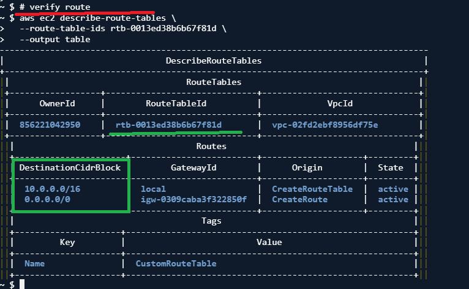

 # associate subnet

~ $ aws ec2 associate-route-table \
>   --subnet-id subnet-013d0b4e7c5183115 \
>   --route-table-id rtb-05f2336e768fc0e73
{
    "AssociationId": "rtbassoc-0503b4586cf8c8475",
    "AssociationState": {
        "State": "associated"
    }
}

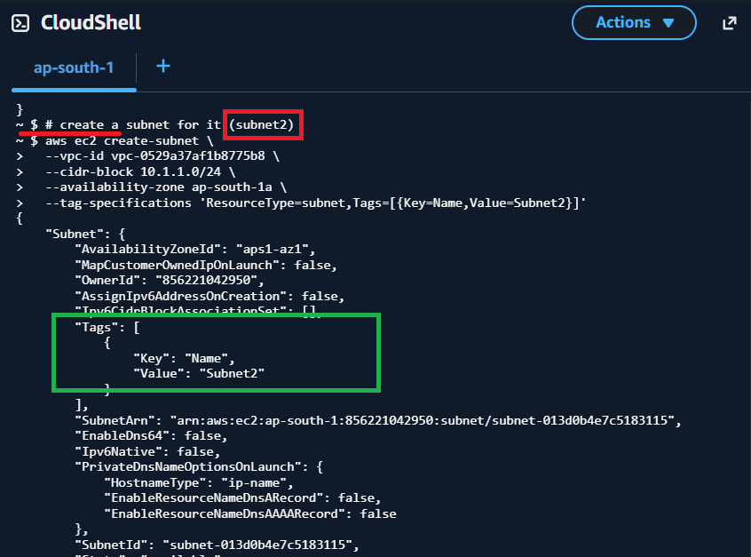

 # verify that Subnet2 is associated with the route table and is now public

~ $ aws ec2 describe-route-tables \
>   --route-table-ids rtb-05f2336e768fc0e73 \
>   --query "RouteTables[*].Associations[*].{Subnet:SubnetId,RouteTable:RouteTableId,Main:Main}" \
>   --output table
----------------------------------------------------------------
|                      DescribeRouteTables                     |
+-------+-------------------------+----------------------------+
| Main  |       RouteTable        |          Subnet            |
+-------+-------------------------+----------------------------+
|  False|  rtb-05f2336e768fc0e73  |  subnet-013d0b4e7c5183115  |
+-------+-------------------------+----------------------------+

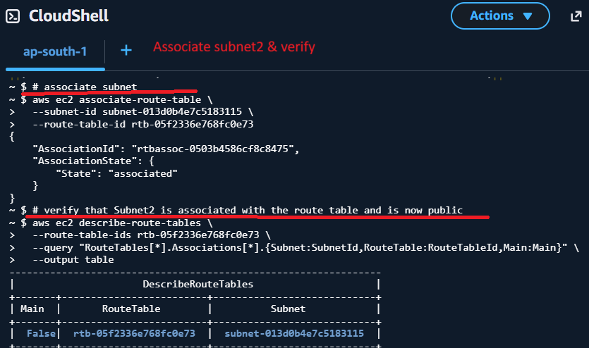

# To list all VPCs in your current region and see both VPC1 and VPC2

~ $ aws ec2 describe-vpcs \
>   --query "Vpcs[*].{VPC_ID:VpcId,CIDR:CidrBlock,Name:Tags[?Key=='Name']|[0].Value}" \
>   --output table
----------------------------------------------------
|                   DescribeVpcs                   |
+----------------+-------+-------------------------+
|      CIDR      | Name  |         VPC_ID          |
+----------------+-------+-------------------------+
|  172.31.0.0/16 |  None |  vpc-0690311ae61c48aec  |
|  10.0.0.0/16   |  None |  vpc-02fd2ebf8956df75e  |
|  10.1.0.0/16   |  VPC2 |  vpc-0529a37af1b8775b8  |
+----------------+-------+-------------------------+

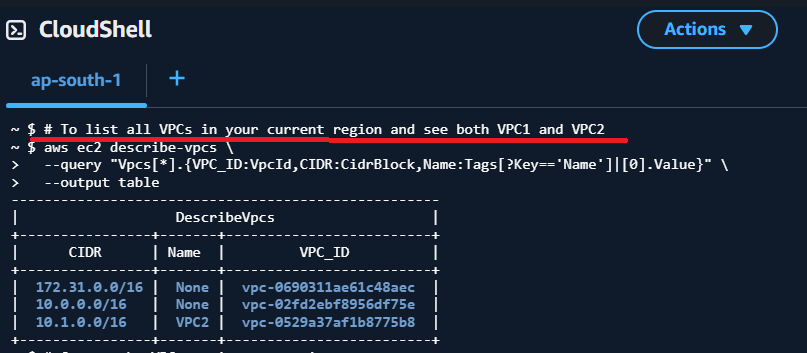

 # Create the VPC peering connection

~ $ aws ec2 create-vpc-peering-connection \
>   --vpc-id vpc-02fd2ebf8956df75e \
>   --peer-vpc-id vpc-0529a37af1b8775b8 \
>   --tag-specifications 'ResourceType=vpc-peering-connection,Tags=[{Key=Name,Value=VPC1-to-VPC2}]'
{
    "VpcPeeringConnection": {
        "AccepterVpcInfo": {
            "OwnerId": "856221042950",
            "VpcId": "vpc-0529a37af1b8775b8",
            "Region": "ap-south-1"
        },
        "ExpirationTime": "2026-04-12T15:15:50+00:00",
        "RequesterVpcInfo": {
            "CidrBlock": "10.0.0.0/16",
            "CidrBlockSet": [
                {
                    "CidrBlock": "10.0.0.0/16"
                }
            ],
            "OwnerId": "856221042950",
            "PeeringOptions": {
                "AllowDnsResolutionFromRemoteVpc": false,
                "AllowEgressFromLocalClassicLinkToRemoteVpc": false,
                "AllowEgressFromLocalVpcToRemoteClassicLink": false
            },
            "VpcId": "vpc-02fd2ebf8956df75e",
            "Region": "ap-south-1"
        },
        "Status": {
            "Code": "initiating-request",
            "Message": "Initiating Request to 856221042950"
        }
    }
},

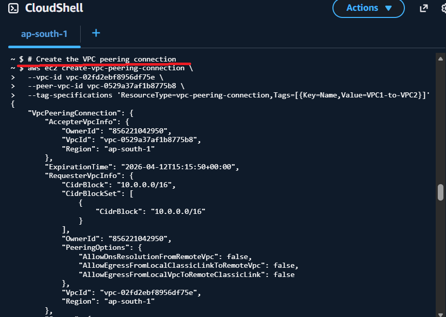

# Accept the VPC peering connection (from VPC2 side)

~ $ aws ec2 accept-vpc-peering-connection \
>   --vpc-peering-connection-id pcx-0c82e8932a8445ba2
{
    "VpcPeeringConnection": {
        "AccepterVpcInfo": {
            "CidrBlock": "10.1.0.0/16",
            "CidrBlockSet": [
                {
                    "CidrBlock": "10.1.0.0/16"
                }
            ],
            "OwnerId": "856221042950",
            "PeeringOptions": {
                "AllowDnsResolutionFromRemoteVpc": false,
                "AllowEgressFromLocalClassicLinkToRemoteVpc": false,
                "AllowEgressFromLocalVpcToRemoteClassicLink": false
            },
            "VpcId": "vpc-0529a37af1b8775b8",
            "Region": "ap-south-1"
        },
        "RequesterVpcInfo": {
            "CidrBlock": "10.0.0.0/16",
            "CidrBlockSet": [
                {
                    "CidrBlock": "10.0.0.0/16"
                }
            ],
            "OwnerId": "856221042950",
            "PeeringOptions": {
                "AllowDnsResolutionFromRemoteVpc": false

            }
        }
    }
        },

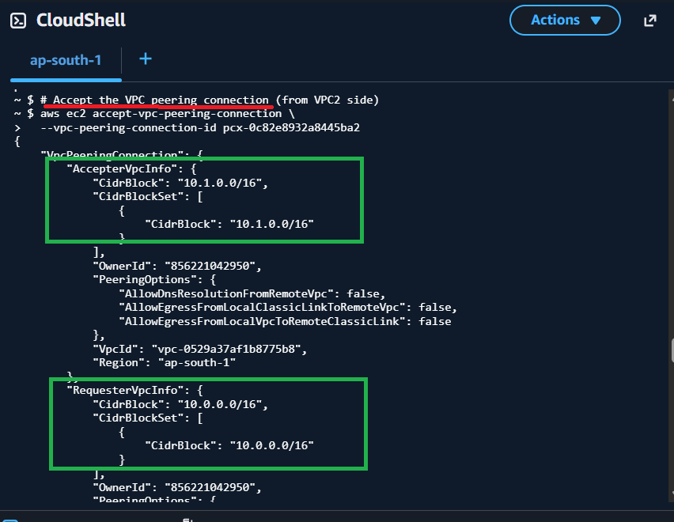

 # verify it’s active

~ $ aws ec2 describe-vpc-peering-connections \
>   --vpc-peering-connection-ids pcx-0c82e8932a8445ba2 \
>   --output table
---------------------------------------------------------------
|                DescribeVpcPeeringConnections                |
+-------------------------------------------------------------+
||                   VpcPeeringConnections                   ||
|+-----------------------------+-----------------------------+|
||  VpcPeeringConnectionId     |  pcx-0c82e8932a8445ba2      ||
|+-----------------------------+-----------------------------+|
|||                     AccepterVpcInfo                     |||
||+------------------+--------------------------------------+||
|||  CidrBlock       |  10.1.0.0/16                         |||
|||  OwnerId         |  856221042950                        |||
|||  Region          |  ap-south-1                          |||
|||  VpcId           |  vpc-0529a37af1b8775b8               |||
||+------------------+--------------------------------------+||
||||                     CidrBlockSet                      ||||
|||+------------------------+------------------------------+|||
||||  CidrBlock             |  10.1.0.0/16                 ||||
|||+------------------------+------------------------------+|||
||||                    PeeringOptions                     ||||
|||+----------------------------------------------+--------+|||
||||  AllowDnsResolutionFromRemoteVpc             |  False ||||
||||  AllowEgressFromLocalClassicLinkToRemoteVpc  |  False ||||
||||  AllowEgressFromLocalVpcToRemoteClassicLink  |  False ||||
|||+----------------------------------------------+--------+|||
|||                    RequesterVpcInfo                     |||
||+------------------+--------------------------------------+||
|||  CidrBlock       |  10.0.0.0/16                         |||
|||  OwnerId         |  856221042950                        |||
:

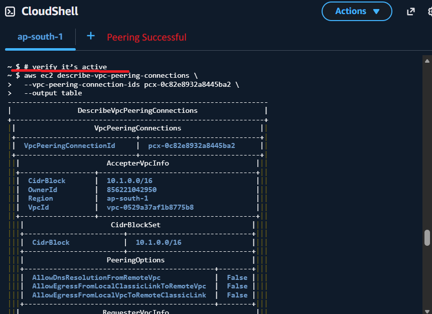

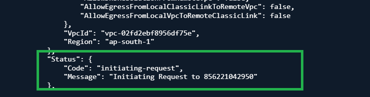

## !!! REMEMBER
Yes — updating the route tables on both sides is required for the VPC peering to actually allow traffic between the VPCs. Creating a peering connection alone does not automatically route traffic.

Here’s why:

VPC peering is just a network link — it doesn’t change routing by itself.
Each VPC still needs a route in its route table that points to the other VPC’s CIDR via the peering connection.

# Update VPC1 route table

~ $ aws ec2 create-route \
>     --route-table-id rtb-08e2bfc131c3c04a7 \
>     --destination-cidr-block 10.1.0.0/16 \
>     --vpc-peering-connection-id pcx-0c82e8932a8445ba2
{
    "Return": true
}

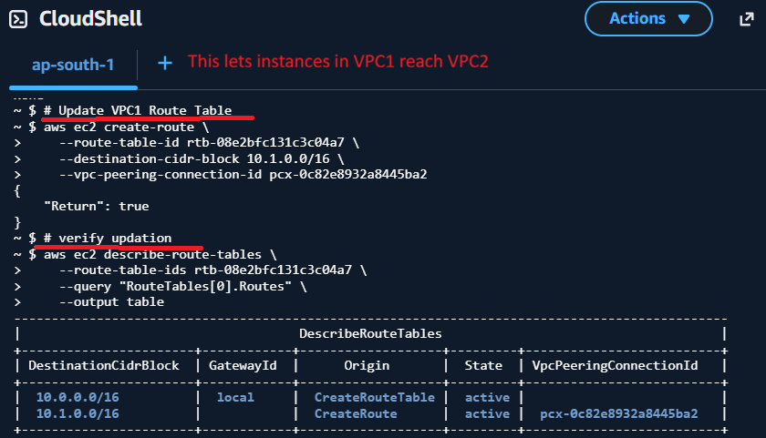

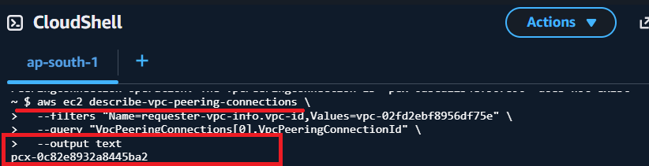

 # verify updation

~ $ aws ec2 describe-route-tables \
>     --route-table-ids rtb-08e2bfc131c3c04a7 \
>     --query "RouteTables[0].Routes" \
>     --output table
-----------------------------------------------------------------------------------------------
|                                     DescribeRouteTables                                     |
+-----------------------+------------+-------------------+---------+--------------------------+
| DestinationCidrBlock  | GatewayId  |      Origin       |  State  | VpcPeeringConnectionId   |
+-----------------------+------------+-------------------+---------+--------------------------+
|  10.0.0.0/16          |  local     |  CreateRouteTable |  active |                          |
|  10.1.0.0/16          |            |  CreateRoute      |  active |  pcx-0c82e8932a8445ba2   |
+-----------------------+------------+-------------------+---------+--------------------------+

✅ This lets instances in VPC1 reach VPC2.

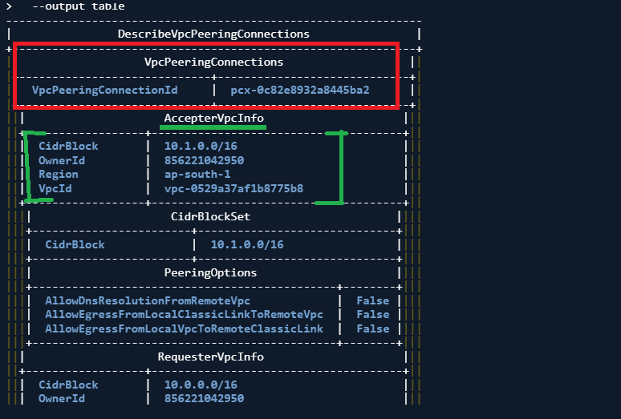

 # Update VPC2 Route Table

~ $ aws ec2 create-route \
>     --route-table-id rtb-05f2336e768fc0e73 \
>     --destination-cidr-block 10.0.0.0/16 \
>     --vpc-peering-connection-id pcx-0c82e8932a8445ba2
{
    "Return": true
}

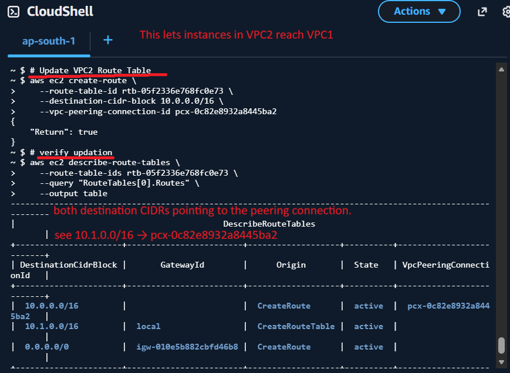

# verify updation

~ $ aws ec2 describe-route-tables \
>     --route-table-ids rtb-05f2336e768fc0e73 \
>     --query "RouteTables[0].Routes" \
>     --output table
-----------------------------------------------------------------------------------------------------------
|                                           DescribeRouteTables                                           |
+----------------------+------------------------+-------------------+----------+--------------------------+
| DestinationCidrBlock |       GatewayId        |      Origin       |  State   | VpcPeeringConnectionId   |
+----------------------+------------------------+-------------------+----------+--------------------------+
|  10.0.0.0/16         |                        |  CreateRoute      |  active  |  pcx-0c82e8932a8445ba2   |
|  10.1.0.0/16         |  local                 |  CreateRouteTable |  active  |                          |
|  0.0.0.0/0           |  igw-010e5b882cbfd46b8 |  CreateRoute      |  active  |                          |
+----------------------+------------------------+-------------------+----------+--------------------------+

- ✅ This lets instances in VPC2 reach VPC1.

- You should see both destination CIDRs pointing to the peering connection.

- If you see 10.1.0.0/16 → pcx-0c82e8932a8445ba2, the route table is updated successfully.

## POST LAB CLEANUP (VERIFIED)

~ $ aws ec2 delete-vpc --vpc-id vpc-0529a37af1b8775b8  # VPC2
~ $ aws ec2 describe-vpcs --query "Vpcs[*].{VPC_ID:VpcId,Name:Tags[?Key=='Name']|[0].Value}" --output table
-----------------------------------
|          DescribeVpcs           |
+------+--------------------------+
| Name |         VPC_ID           |
+------+--------------------------+
|  None|  vpc-0690311ae61c48aec   |
+------+--------------------------+

~ $ aws ec2 describe-vpcs --query "Vpcs[*].{VPC_ID:VpcId,Name:Tags[?Key=='Name']|[0].Value}" --output table
-----------------------------------
|          DescribeVpcs           |
+------+--------------------------+
| Name |         VPC_ID           |
+------+--------------------------+
|  None|  vpc-0690311ae61c48aec   |

+------+--------------------------+

~ $ aws ec2 describe-subnets --query "Subnets[*].{SubnetId:SubnetId,VpcId:VpcId,Name:Tags[?Key=='Name']|[0].Value}" --output table
---------------------------------------------------------------
|                       DescribeSubnets                       |
+------+----------------------------+-------------------------+
| Name |         SubnetId           |          VpcId          |
+------+----------------------------+-------------------------+
|  None|  subnet-0b4d03067ff36906b  |  vpc-0690311ae61c48aec  |
|  None|  subnet-003cbe0885aa9c2d0  |  vpc-0690311ae61c48aec  |
|  None|  subnet-0b5c3a1c46751ea8f  |  vpc-0690311ae61c48aec  |

+------+----------------------------+-------------------------+

~ $ aws ec2 describe-internet-gateways --query "InternetGateways[*].{IGWId:InternetGatewayId,Vpc:Attachments[0].VpcId,Name:Tags[?Key=='Name']|[0].Value}" --output table
------------------------------------------------------------
|                 DescribeInternetGateways                 |
+------------------------+-------+-------------------------+
|          IGWId         | Name  |           Vpc           |
+------------------------+-------+-------------------------+
|  igw-0999c9142ee41e794 |  None |  vpc-0690311ae61c48aec  |
+------------------------+-------+-------------------------+

~ $ aws ec2 describe-route-tables --query "RouteTables[*].{RouteTableId:RouteTableId,VpcId:VpcId,Name:Tags[?Key=='Name']|[0].Value}" --output table
------------------------------------------------------------
|                    DescribeRouteTables                   |
+------+-------------------------+-------------------------+
| Name |      RouteTableId       |          VpcId          |
+------+-------------------------+-------------------------+
|  None|  rtb-00a8c145743b6113b  |  vpc-0690311ae61c48aec  |
+------+-------------------------+-------------------------+

~ $ aws ec2 describe-vpc-peering-connections --query "VpcPeeringConnections[*].{ID:VpcPeeringConnectionId,Requester:RequesterVpcInfo.VpcId,Accepter:AccepterVpcInfo.VpcId,Status:Status.Code}" --output table
----------------------------------------------------------------------------------------
|                             DescribeVpcPeeringConnections                            |
+-----------------------+-------------------------+-------------------------+----------+
|       Accepter        |           ID            |        Requester        | Status   |
+-----------------------+-------------------------+-------------------------+----------+
|  vpc-0529a37af1b8775b8|  pcx-0c82e8932a8445ba2  |  vpc-02fd2ebf8956df75e  |  deleted |
+-----------------------+-------------------------+-------------------------+----------+
~ $ 

# Post-Lab Cleanup Theory (Ordered)

. VPC Peering Connection
Must be deleted first because both VPCs depend on it.
Peering connections block deletion of VPCs if still active.

. Internet Gateways (IGWs)
Detach the IGWs from their respective VPCs before deletion.
IGWs cannot be deleted while attached to a VPC.

. Custom Route Tables
Delete any non-default route tables created in the lab.
Default route tables cannot be deleted.

. Subnets
Delete all lab-created subnets inside the VPCs.
A VPC cannot be deleted while it still has subnets.

. VPCs
Delete the lab VPCs after all dependent resources are removed.
Default VPC is left intact; only custom VPCs are deleted.